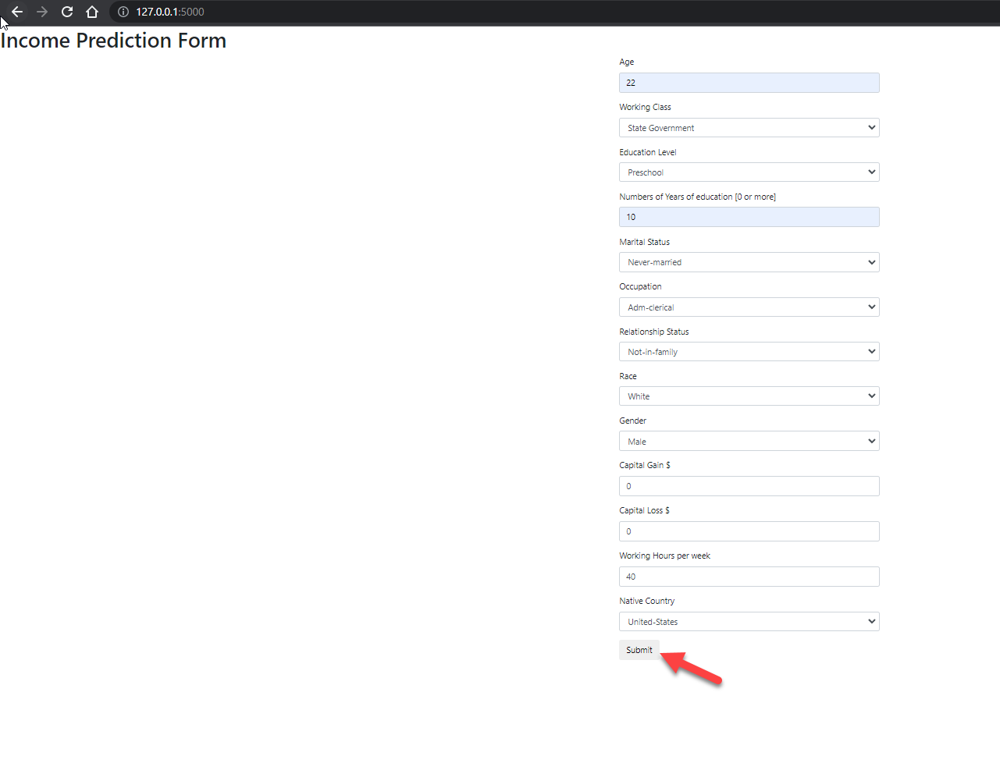
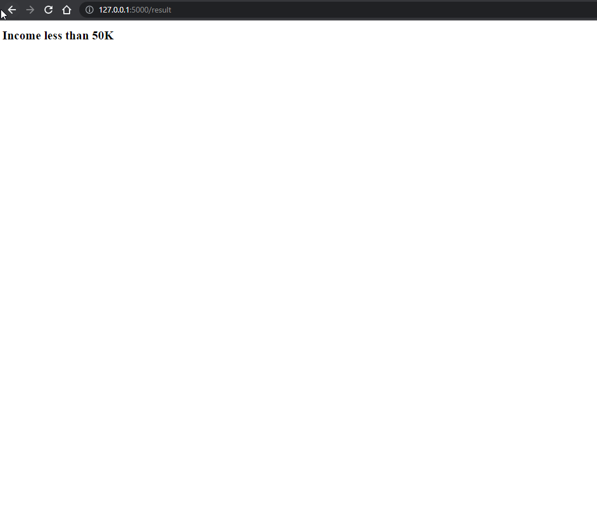

# mlmodel-deploy-using-flask

This project will walk you through an end-end example of how you can read raw data using Python and then train multiple ML models to choose the best one. The current implementation does not do hyperparameter tuning, but I will implement it in the future.

After finding the best ML model, you will also learn how to deploy this model as a REST endpoint using Flask on your local machine while serving up a basic form for end-users to provide new inputs for generating inference.

The dataset comes from [Kaggle.com](https://www.kaggle.com/uciml/adult-census-income). This data was extracted from the 1994 Census bureau database by Ronny Kohavi and Barry Becker (Data Mining and Visualization, Silicon Graphics). A set of reasonably clean records was extracted using the following conditions: ((AAGE>16) && (AGI>100) && (AFNLWGT>1) && (HRSWK>0)). The prediction task is to determine whether a person makes over $50K a year.

There are 32561 records with 15 features.

Our model will predict the salary range (>50K USD or <50K USD) per year based on the provided inputs provided by the end user.

# Software and package requirements
1. Python 3.8.10
2. Git

# Python Libraries utilized 
1. venv
2. pandas
3. numpy
4. sklearn
5. flask

# Installation
```
$ git clone https://github.com/debu-sinha/mlmodel-deploy-using-flask.git
$ cd mlmodel-deploy-using-flask
```

# Usage
```
$ python -m venv env
$ source env/bin/activate
$ pip install -r requirements.txt
# python app.py
```

Open http://127.0.0.1:5000 in browser.



```
Enter integer value for all the text boxes and press submit.
```



# License
MIT License

Copyright (c) [2022] [Debu Sinha]

Permission is hereby granted, free of charge, to any person obtaining a copy
of this software and associated documentation files (the "Software"), to deal
in the Software without restriction, including without limitation the rights
to use, copy, modify, merge, publish, distribute, sublicense, and/or sell
copies of the Software, and to permit persons to whom the Software is
furnished to do so, subject to the following conditions:

The above copyright notice and this permission notice shall be included in all
copies or substantial portions of the Software.

THE SOFTWARE IS PROVIDED "AS IS", WITHOUT WARRANTY OF ANY KIND, EXPRESS OR
IMPLIED, INCLUDING BUT NOT LIMITED TO THE WARRANTIES OF MERCHANTABILITY,
FITNESS FOR A PARTICULAR PURPOSE AND NONINFRINGEMENT. IN NO EVENT SHALL THE
AUTHORS OR COPYRIGHT HOLDERS BE LIABLE FOR ANY CLAIM, DAMAGES OR OTHER
LIABILITY, WHETHER IN AN ACTION OF CONTRACT, TORT OR OTHERWISE, ARISING FROM,
OUT OF OR IN CONNECTION WITH THE SOFTWARE OR THE USE OR OTHER DEALINGS IN THE
SOFTWARE.
